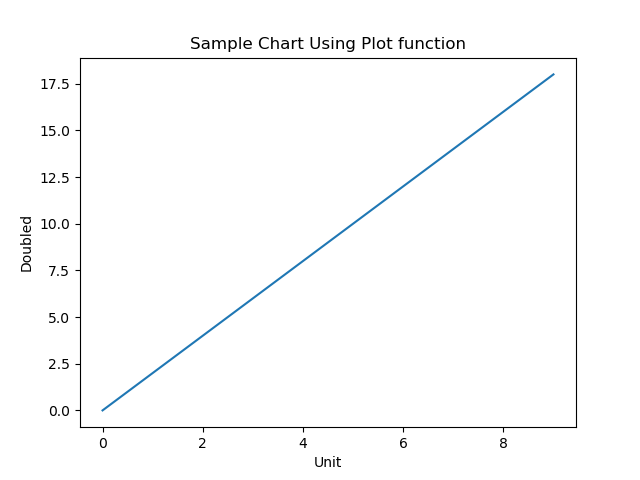
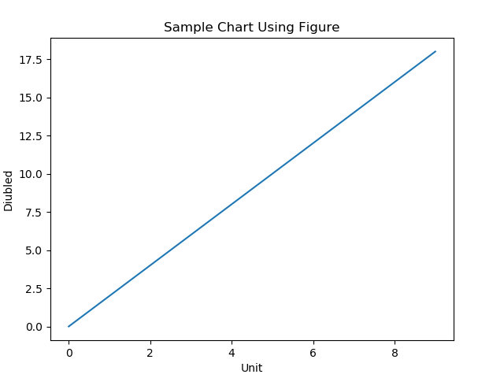
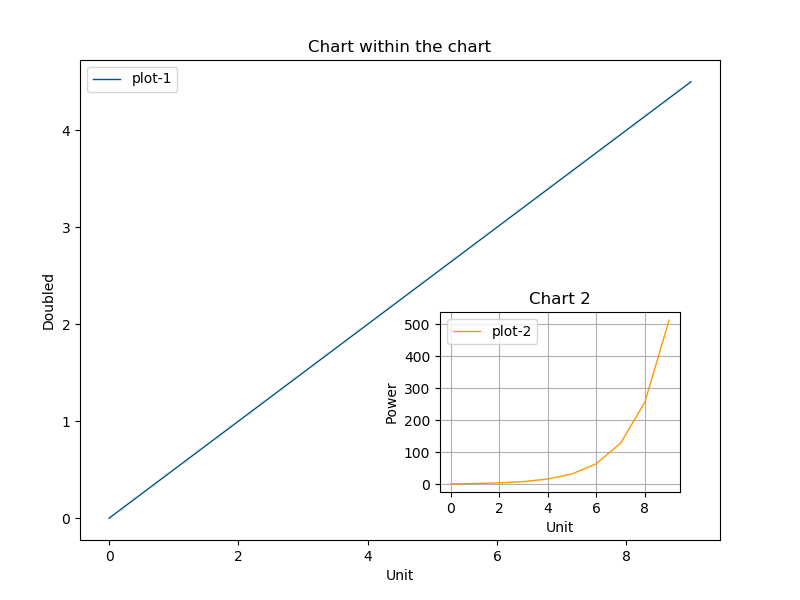

# Plot

## plot funcion 
A simple plot function is availabel which can be used to rander a basic chart.
```python
import matplotlib.pyplot as plt
x = [i for i in range(10)]
y = [2*i for i in x]

plt.plot(x, y)
plt.xlabel("Unit")
plt.ylabel("Doubled")
plt.title("Sample Chart Using Plot function")
plt.show()
```


## Figure instance
Alternate option is to use a figure instance.
```python
import matplotlib.pyplot as plt
x = [i for i in range(10)]
y = [2*i for i in x]

figure = plt.figure()
chart = figure.add_axes([0.1, 0.1, 0.8, 0.8])
chart.plot(x,y)
chart.set_xlabel("Unit")
chart.set_ylabel("Diubled")
chart.set_title("Sample Chart Using Figure")
plt.show()
```


## Multiple charts in a figure
We can add more than one axes in a figure as well. Below is one such example. 
```python
import matplotlib.pyplot as plt
x = [i for i in range(10)]

figure = plt.figure(figsize=(8,6), facecolor="#DFDFDF", edgecolor="#EFEFEF")

# add first axes
axes = figure.add_axes([0.1, 0.1, 0.8, 0.8])
axes.plot(x, [i/2 for i in x], color='#005588', linewidth=1, label='plot-1')
axes.set_xlabel("Unit")
axes.set_ylabel("Doubled")
axes.set_title("Chart within the chart")
axes.legend()

# add another axes with specific positions
axes_1 = figure.add_axes([0.55, 0.15, 0.30, 0.30])
axes_1.grid()
axes_1.plot(x, [2**i for i in x], color='#FF9900', linewidth=1, label='plot-2')
axes_1.set_xlabel("Unit")
axes_1.set_ylabel("Power")
axes_1.set_title("Chart 2")
axes_1.legend()
plt.show()
``` 
