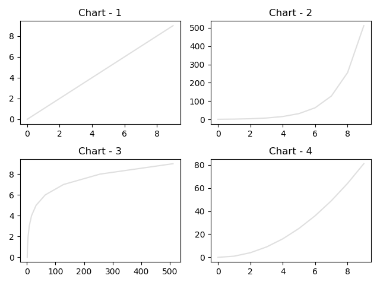

# Subplot
`subplot` or `subplots` function can also be used to create figure with one or more axes respectively.  

### Use of subplot
```python
import matplotlib.pyplot as plt

figure, axes = plt.subplot()
axes.set_title("Figure with single axes")
...
...
plt.show()
```

### User of subplots
`subplots` can create a figure with multiple axes.
```python
import matplotlib.pyplot as plt

figure, axeses = plt.subplots(nrows=2, ncols=2, tight_layout=True)
axeses[0][0].set_title("Axes 1")
...
axeses[0][1].set_title("Axes 2")
...
axeses[0][1].set_title("Axes 3")
...
axeses[0][1].set_title("Axes 4")
...
plt.show()
```

<br/>

## Examples

Following is a sample code that plots a 2x2 grid of charts using subplot.

```python
import matplotlib.pyplot as plt
x = [i for i in range(10)]

figure, axeses = plt.subplots(nrows=2, ncols=2, tight_layout=True,  facecolor="#DFDFDF")

axeses[0][0].set_title("Chart - 1")
axeses[0][0].plot(x,x, color='#DFDFDF')

axeses[0][1].set_title("Chart - 2")
axeses[0][1].plot(x,[2**i for i in x], color='#DFDFDF')

axeses[1][0].set_title("Chart - 3")
axeses[1][0].plot([2**i for i in x], x, color='#DFDFDF')

axeses[1][1].set_title("Chart - 4")
axeses[1][1].plot(x,[i**2 for i in x], color='#DFDFDF')

plt.show()
```

