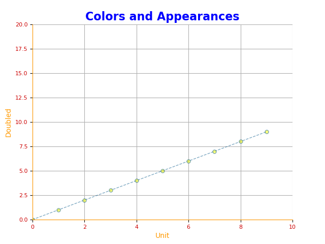

# Appearance
We can customize the appearance of chart with various color and styling options provided in matplotlib.

## Customize figure

#### Size
We can customize the size of the figure by providing a tuple as in (width, height) to `figsize` params. 
```python
figure = plt.subplot(figsize=(8, 6))
## creates figure of width 8 inches and with height 6 inches
```
#### Backgound and border
We can customize the bacground color and border color of the figure by `facecolor` and `edgecolor` respectively.
```python
figure = plt.figure(facecolor="#DFDFDF", edgecolor="#EFEFEF")
# creates figure with custom background and border color
```

## Customize Axes

#### Title
```python
axes.set_title("Colors and Appearances", 
    color="blue",                             # sets color of the title 
    fontsize=16,                              # sets font size for the title
    fontweight='bold')                        # sets bold font 
```

#### Spines
```python
axes.spines['top'].set_color(None)              # hides top border in axes
axes.spines['right'].set_color(None)            # hides right border in axes
axes.spines['bottom'].set_color('#FF9900')      # sets bottom border color
axes.spines['left'].set_color("#FF9900")        # sets left border color
```

#### Ticks
```python
axes.tick_params(axis='both',   # applies to both axis 
    labelcolor='#CC0000',       # sets tick color
    labelsize=8)                # sets tick label size
``` 

#### Labels
```python
axes.set_xlabel("X label", color="#FF9900")    # sets label color on X axis
axes.set_ylabel("Y Label", color="#FF9900")    # sets label color on Y axis
```

## Customize grid
We can add grid to our axes
```python
axes.grid()                     # Adds grid to axes
```

## Custome the plot
Library provides various customization options for the plot.

#### Line
We can set the line color by `color` param. Change the thickness and style of the line.
```python
plt.plot(x, y, 
    color='#005588',           # sets color of the line
    linewidth=1,               # sets thickness of the line
    linestyle='dashed')        # sets style of the line
```

#### Marker
We can also add marker to the plot
```python
plt.plot(x, y, 
    marker='o',
    markersize=4,
    markerfacecolor='#FF9900',
    markeredgecolor='#006699',
    markeredgewith=1)
```

#### Boundry
```python
axes.set_xlim([0, 10])       # Crops X axes to the provided range
axes.set_ylim([0, 20])       # Crops Y axes to the provided range
```

<br/>

### Example
Below is an example code that demonstrate the various customization we discussed above.
```python
import matplotlib.pyplot as plt
x = [i for i in range(10)]

figure = plt.figure(facecolor="#DFDFDF", edgecolor="#EFEFEF")
axes = figure.add_axes([0.1, 0.1, 0.8, 0.8])
axes.grid()
axes.plot(x, x, 
    color='#005588', 
    linewidth=1, 
    alpha=0.5, 
    linestyle='dashed', 
    marker='o', 
    markersize=5,
    markerfacecolor='#FF9900',
    markeredgecolor='#005588',
    markeredgewidth=1)
axes.set_xlabel("Unit", color="#FF9900")
axes.set_ylabel("Doubled", color="#FF9900")
axes.set_title("Colors and Appearances", 
    color="blue", 
    fontsize=16,
    fontweight='bold')

axes.spines['top'].set_color(None)
axes.spines['right'].set_color(None)
axes.spines['bottom'].set_color('#FF9900')
axes.spines['left'].set_color("#FF9900")

# ticks
axes.tick_params(axis='both', labelcolor='#CC0000', labelsize=8)

axes.set_xlim([0, 10])
axes.set_ylim([0, 20])
plt.show()
```

